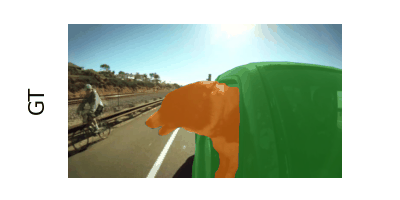
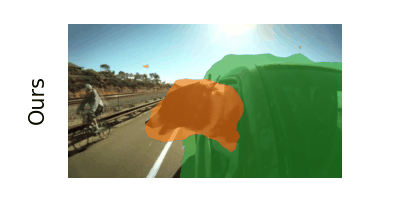
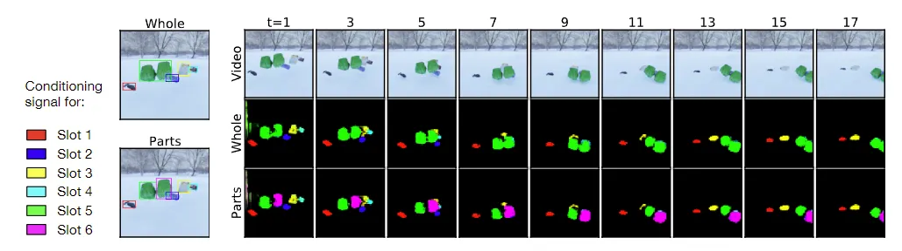
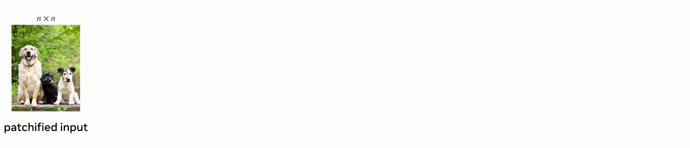
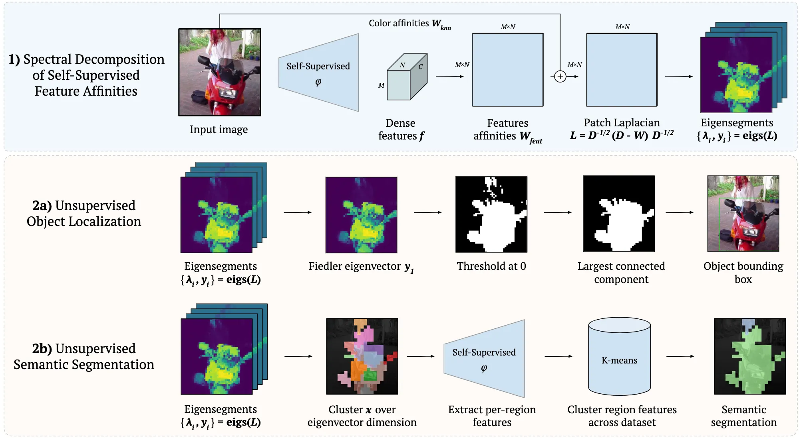
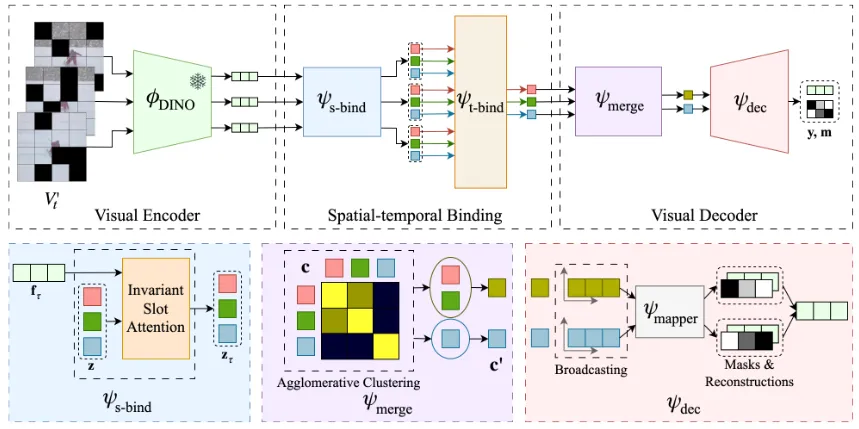
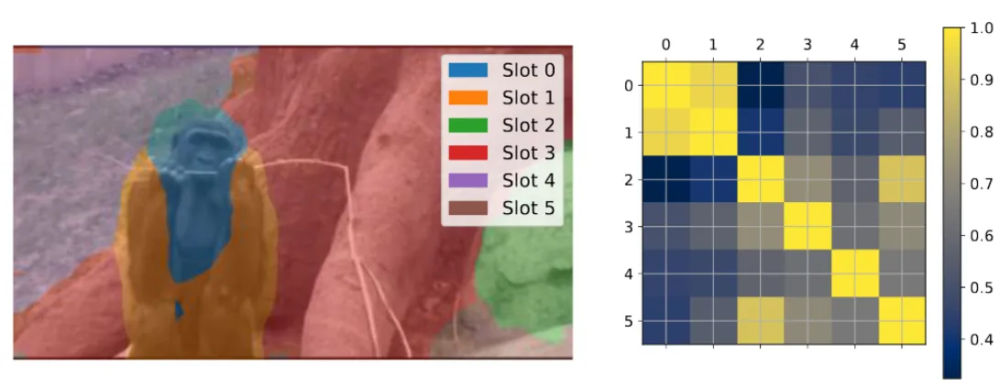
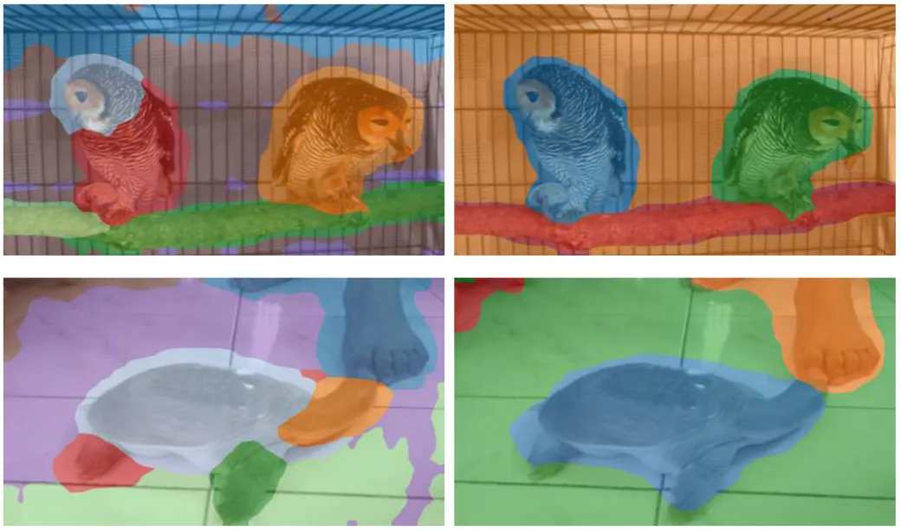

> 来源：[NIPS 2023](https://openreview.net/group?id=NeurIPS.cc/2023/Conference)
>
> 论文地址：[http://arxiv.org/abs/2310.06907](http://arxiv.org/abs/2310.06907)
>
> 代码地址：❌
>
> 作者主页：二作谢伟迪主页[https://weidixie.github.io/](https://weidixie.github.io/)
>
> 项目主页：[https://kuis-ai.github.io/solv/](https://kuis-ai.github.io/solv/)
>
> 评价：well-written
>

# 介绍
**背景**：<u>无监督多目标分割</u>借助自监督学习预训练中学习到的强力的语义信息展示了显著的效果。通常也是通过添加额外的模态（比如深度、动作）来增强视频序列的分割结果。然而，在 _合成序列 _中观察到的性能提升<u>依赖</u>于额外信息的鲁棒性，并不能转化为更具挑战的真实世界场景。

**任务**：给定一个复杂场景的视频序列，目标是训练一个视觉系统能够<u>发现、追踪和分割</u>图像帧里的目标，将数百万的像素的视觉信息抽象为_ 语义部分_。（object-centric视觉表征学习）

<figure class="main-figure">
  

    

      
      
(a) Ground Truth

    

    

      
      
(b) Prediction

    

  

  <!-- <figcaption>
    非对称比例对比
  </figcaption> -->
</figure>

**领域的发展**：从 _合成图像_ 开始，转向<u>in-the-wild</u>图像和<u>real-world</u>视频。现有方法通常使用自编码器训练范式（如重建输入信号，希望能基于数据或结构的先验来将<u>区域像素</u>分组为有语义意义的对象）。

+ 对图像：使用来源于预训练模型的<u>低级特征</u>（如颜色、语义特征等）来确定像素到目标的分配
+ 对视频：通常结合额外的模态、信号（如光流、深度图），可直接从不连续性获得分割掩码

## 提出问题
**使用额外信息带来的问题**：在视频中使用额外的信号会增加**计算开销**和**误差累积**。比如光流信号在处理<u>静态或可变形</u>物体以及帧间<u>大位移</u>时可能会产生问题，而深度值在普通视频中可能不易获得，在<u>低光照</u>或<u>低对比度</u>环境中其估算也会受到影响。

**过度分割问题**：由于视觉场景的复杂性，使用固定数量的<u>slots</u>可能导致过度分割问题（over-segmentation issuse）。

## 解决问题
**作者方法**：**首次**提出用于<u>真实世界序列中多目标分割</u>的完全无监督方法。SOLV，一个能够发现真实世界视频序列中多个目标且不使用额外的模态信息或任何类似弱监督方法（比如使用第一帧进行初始化）。

**方案**：使用轴向空间-时隙注意力（axial spatial-temporal slot attentions）

+ 首先对每帧内空间区域进行分组
+ 然后使用来自相邻帧的交互来丰富时隙表示（slot representations）

**训练策略**：masked autoencoder（MAE）训练范式。两个优势：

1. 充当信息瓶颈（information bottleneck），让模型观察部分区域，强迫模型学习高级语义结构。
2. 缓解内存限制，有助于提高计算效率

针对**over-segmentation**问题：作者通过使用简单的聚类算法来融合相似的slots。

总的来说，贡献如下：

+ 提出一个在真实世界视频上的自监督多目标分割模型，使用axial spatial-temporal slots attention，能有效地将具有相似特性的视觉区域进行分组，而不需要使用<u>额外的信号</u>。
+ 展示了一个基于掩码特征重建的object-centric学习方式以及slot融合方法。
+ MOVi-E和Youtube-VIS 2019数据集上的SOTA以及DAVIS2017数据集上的具有竞争力的性能。

> slot即视频中的各物体对象，见下图。
>

## 相关工作
### Object-centric Learning
图像和视频的object-centric无监督表征学习现有几种解决办法：

+ 对比学习方法：
    - Object discovery and representation networks.（ECCV2022）
    - Contrastive learning of structured world models.（ICLR2020）
    - Groupvit: Semantic segmentation emerges from text supervision.（CVPR2022）
+ 重建目标方法（将输入切分乘潜在空间中的一组区域辨识变量，即slots，然后将其和对象的不同对象进行绑定）：
    - 应用于图像：
        * Multi-object representation learning with iterative variational inference.（ICML2019）
        * Monet: Unsupervised scene decomposition and representation.
        * Spatially invariant unsupervised object detection with convolutional neural networks.（AAAI2019）
        * Generative scene graph networks.（ICLR2021）
        * Genesis: Generative scene inference and sampling with object-centric latent representations.（ICLR2020）
        * Space: Unsupervised object-oriented scene representation via spatial attention and decomposition.（ICLR2020）
        * Unsupervised foreground extraction via deep region competition.（NIPS2021）
        * Attend, infer, repeat: Fast scene understanding with generative models（NIPS2016）
        * Tagger: Deep unsupervised perceptual grouping.（NIPS2016）
        * Unsupervised learning of compositional energy concepts.（NIPS2021）
        * Object-centric learning with slot attention.（NIPS2020）
        * Illiterate dall-e learns to compose.（ICLR2022）
    - 应用于视频：
        * Simone: View-invariant, temporally-abstracted object representations via unsupervised video decomposition.（NIPS2021）
        * Faster attend-infer-repeat with tractable probabilistic models.（ICLR2019）
        * Neural expectation maximization.（NIPS2017）
        * Conditional object-centric learning from video.（ICLR2022）
        * Scalor: Generative world models with scalable object representations.（ICLR2020）
        * Entity abstraction in visual model-based reinforcement learning.（CoRL2020）
        * Parts: Unsupervised segmentation with slots, attention and independence maximization.🤔（ICCV2021）
        * Sequential attend, infer, repeat: Generative modelling of moving objects.（NIPS2018）

这些方法都是在合成数据上进行验证的，且由于复杂性的增加，很难推广到现实世界的场景中。为解决这个问题，之前的研究者们考虑探索额外的信息引导：

+ 基于3D结构：
    - Roots: Object-centric representation and rendering of 3d scenes.（JMLR2021）
    - Giraffe: Representing scenes as compositional generative neural feature fields.（CVPR2021）
    - Unsupervised object-centric video generation and decomposition in 3d.（NIPS2020）
+ 基于不同模态信息的重建：
    - 光流：Conditional object-centric learning from video.（ICLR2022）
    - 深度：Savi++: Towards end-to-end object-centric learning from real-world videos.（NIPS2022）

当前，在没有精确引导的情况下准确识别复杂视觉场景中的物体仍具有挑战。现有工作以来于从<u>运动分割掩码</u>[R1-2]或<u>初始对象位置</u>[R3-4]的引导初始化。为克服这个局限，DINOSAUR[R6]借助之前的预训练模型[R5]学习到的归纳偏置来重建特征空间。<u>作者也是这个方法来在真实数据中学习object-centric表征，无需任何引导初始化或明显的监督信号。</u>

### Object Localizaiton from DINO Features
DINO展示了VIT在自监督学习中超强的性能。一些研究者[R7]通过聚类等传统的图划分方法将DINO提取到的特征进行分组，应用在下游任务中。CutLER将这个方法进行了扩展，提出了MaskCut可以不断的生成伪标签并更新，借此训练网络。

![Observations from Deep Spectral Methods[R7]](4.png)

<!-- 这是一张图片，ocr 内容为：COLOR AFFINITIES W MXN MXN KNN 1) SPECTRAL DECOMPOSITION N SELF-SUPERVISED MXN MXN OF SELF-SUPERVISED 0 M FEATURE AFFINITIES PATCH LAPLACIAN EIGENSEGMENTS FEATURES DENSE INPUT IMAGE LDI/2(D-W)D-1/2 FEATURES F {Y,Y;EIGS(L) AFFINITIES W FEAT 2A)UNSUPERVISED OBJECT LOCALIZATION FIEDLER EIGENVECTOR YI THRESHOLD AT 0 EIGENSEGMENTS OBJECT BOUNDING LARGEST CONNECTED {A;Y)EIGS(L) BOX COMPONENT 2B)UNSUPERVISED SELF-SUPERVISED K-MEANS SEMANTIC SEGMENTATION P EIGENSEGMENTS EXTRACT PER-REGION CLUSTER REGION FEATURES CLUSTER X OVER SEMANTIC {AY)EIGS(L) EIGENVECTOR DIMENSION FEATURES ACROSS DATASET SEGMENTATION -->

### Video Object Segmentation
Video Object Segmentation(VOS)旨在识别视频中<u>显著的对象</u>：

+ 无监督设置下，不依赖标注，
+ 半监督设置下的评估仅标注第一帧。

推理过程是无监督的，但是训练过程中仍要用到标注数据。<u>Relying on labelled data during training might introduce a bias towards the labelled set of classes that is available during training.</u>使用标记数据会导致模型训练产生偏置效果，即偏向训练数据中的已标记类别对象。

<u>动作信息</u>通常在无监督VOS中用于跨时间匹配对象区域。在用objecti-centric方法进行多实例对象分离时，动作信息尤为方便。Motion Grouping学习object-centric表征，通过对流中的patterns进行分组来分割运动对象。最近的工作主要借助序列模型，引入额外的信息。本工作中，作者从多个帧中学习temporal slot时隙表征，<u>不使用任何显式的运动信息</u>。这样可以避免在<u>无法可靠地估计flow时导致的性能下降</u>。

> [R1]: Discovering objects that can move.（CVPR2022）
>
> [R2]: Object discovery from motion-guided tokens.（CVPR2023）
>
> [R3]: Savi++: Towards end-to-end object-centric learning from real-world videos.（NIPS2022）
>
> [R4]: Conditional object-centric learning from video.（ICLR2022）
>
> [R5]: Emerging properties in self-supervised vision transformers.（ICCV2021）
>
> [R6]: Bridging the gap to real-world object-centric learning.（ICLR2023）
>
> [R7]: Deep Spectral Methods: A Surprisingly Strong Baseline for Unsupervised Semantic Segmentation and Localization.（CVPR2022）

# 方法
首先介绍考虑到的场景问题，然后描述提出的object-centric结构细节。

### Problem Scenario
<strong>输入：</strong>给定一个RGB视频片段作为输入，比如$ \mathcal{V}_t=\{\rm{v_{t-n}},\cdots,v_t, \cdots, v_{t+n}\}\in\mathbb R^{(2n+1)\times H\times W\times 3} $

<strong>我们的目标：</strong>训练一个object-centric模型，能够处理这个片段，输出所有对象实例的分割掩码，比如发现并追踪视频中的实例

借助自监督学习，我们将该问题用公式来描述为：

$$ m_t=\Phi(\mathcal V_t;\Theta)=\Phi_{vis-dec}\circ\Phi_{st-bind}\circ\Phi_{vis-enc}(\mathcal V_t)\tag{1} $$

这里$ m_t\in\mathbb R^{K_t\times H\times W} $表示中间帧的输出分割掩码，$ K_t $是被认为是对象的数量。对每帧进行分割后，再使用<u>Hungarian matching</u>来追踪视频中的跨帧对象。$ \Phi(\cdot;\Theta) $是提出的分割模型，由三个核心组件组成：

+ visual encoder视觉编码器 - 用于逐帧提取视觉特征
+ spatial-temporal axial binding - 首先将像素分组到帧内的slots中，然后跨时间帧来连接这些slots
+ visual decoder视觉解码器 - 通过对spatial-temporal slots进行解码，重建密集的视觉特征，副产品为目标的分割掩码

### 结构剖析
作者提出的结构是Transformer的变体，训练方式和简单的masked autoencoder一致，比如根据给定的部分输入观察来重建完整的信号。和标准的MAE不同的是，MAE在<u>像素</u>空间重建<u>图像</u>，作者的则是一个信息瓶颈设计information bottleneck design：

+ 首先将spatial-temporal特征分配到slots中
+ 然后从潜在slots中重建密集<u>视觉特征</u>

由此，每个slot都被附加到一个语义上有意义的对象上，且可通过重建过程获得分割掩码（副产品），不依赖手工标注的标签。

#### Visual Encoder
和标准的VIT一样，对输入的RGB视频片段，我们将每张图像切分为不重叠的patches，得到$ \mathcal V_t=\{v_{t-n},\cdots,v_t,\cdots,v_{t+n}\}\in\mathbb R^{(2n+1)\times N\times(3P^2)} $，这里的$ N=HW/P^2 $表示用尺寸为$ P $的patch来对每帧提取到的tokens的数量。Visual Encoder有token drop和特征提取组成。

<strong>Token Drop：</strong>作为encoder的输入，我们只采样patches的部分子集。采样策略非常直接：随机丢弃每帧固定比率的输入patches，这里$ N' $即随机采样后得到的tokens数量：

$$
\begin{align}
\mathcal V_t&=\{{v'_{t-n},\cdots,v'_{t+n}}\}
\\&=\{\mathrm{drop(v_{t-n}),\cdots,\mathrm{drop(v_{t+n})}}\}\in\mathbb R^{(2n+1)\times N'\times(3P^2)}, \quad N'\lt N
\end{align}
\tag{2}
$$

**Feature Extraction：**特征提取部分，作者直接使用DINOv2训练好的VIT权重来进行初始化，并固定参数：

$$\mathcal F=\{\mathrm{f_{t-n}, \cdots, f_{t+n}\}=\bigg\{\phi_{DINO}(v'_{t-n}),\cdots,\phi_{DINO}(v'_{t+n})\bigg\}}\in\mathbb R^{(2n+1)\times N'\times D}\tag{3} $$

这里$ D $是DINOv2最后一个block输出特征的维度，在最后一个Layer Normalization之前。作者这样设计有两点原因：

+ masked autoencoding在NLP和CV任务中，通常作为自监督学习的代理任务，借助作者的token drop来强迫模型获取高质量的视觉表征
+ 对视频数理来说，额外的时序轴引入了几个数量级的数据，处理采样后的稀疏视觉tokens可以极大地减少内存预算，作者后面有进行验证

#### Spatial-temporal Binding
从每帧提取到视觉特征后，首先在空间上将图像区域分组到slots中，每个slot指定一个语义对象， 即在单张图像中发现对象的过程；然后用Transformer在slots中建立temporal binding，也就是关联视频片段中的对象。

$$
\Phi_{\mathrm{st-bind}}(\mathcal F)=\psi_{\mathrm{t-bind}}\big(\psi_{\mathrm{s-bind}}(\bold f_{t-n}),\cdots,\psi_{\mathrm{s-bind}}(\bold f_{t+n})\big)\in\mathbb R^{K\times D_{\rm slot}}\tag{4}
$$

**Spatial Binding** ($ \psi_{\bold{s-bind}} $)：Spatial binding过程独立作用于各帧。作者使用Biza提出的[invariant slot attention](https://invariantsa.github.io/)，有一点不同，在每个时间步$ \mathcal T\in\{t-n,\cdots,t+n\} $使用一个共享的初始化$ \mathcal {Z_T} $。

具体来说，给定一个时间步$ \mathcal T $的特征经过token drop之后作为输入，我们学习一组初始化的向量，用$ K $个slot向量$ \bold z^j\in\mathbb R^{D_{\rm slot}} $、$ K $个缩放向量$ \bold S^j_s\in\mathbb R^2 $、$ K $个位置向量$ \bold S^j_p\in\mathbb R^2 $以及一个绝对位置嵌入grid$ \bold G_{abs}\in\mathbb R^{N\times 2} $分别平移和缩放每个slot的输入位置编码。

作者将特征编码中被丢弃的tokens对应的patches遮住，对每帧$ \tau $得到一个绝对位置嵌入$ \bold G_{abs}=\rm drop(\bold G_{abs})\in\mathbb R^{N'\times 2} $。对每帧图像，我们可以得到下面的一组可学习向量：

$$
\mathcal Z_\tau=\bigg\{(\bold z^j,\bold S^j_s,\bold S^j_p,\bold G_{abs,\tau})\bigg\}^K_{j=1}\tag{5}
$$

这里这些可学习的参数是对所有帧共享的，且根据对应帧的密集视觉特征进行更新。也就是说，不同帧的slots刚开始是相同的表征，经过bind操作之后由于有和帧内特征的交互而不同。本质上来说，连续的帧通常具有相似的视觉上下文信息，因此使用学习到的slots自然地会促进temporal binding，即具有相同索引的slots能够跨帧绑定到相同的对象区域。

> Invariant slot attention细节见原文，粗略看下来是利用位置编码来学习关系。

**Temporal Binding** ($ \psi_{\bold{t-bind}} $): 到这里为止，模型只能通过利用来自单个帧的信息来发现对象。本节的目的是借助时间上下文信息来增强slot表征。给定一个来自spatial binding模块的输出slots$ \bigg\{\{\bold{z}^j_{t-n}\}^K_{j=1},…,\{\bold{z}^j_{t+n}\}^K_{j=1}\bigg\}\in\mathbb R^{(2n+1)\times K\times D_{\rm slot}} $，作者直接使用Transformer编码器来处理跨不同帧且具有相同索引的输出slots，这里自注意力机制学习的是一个跨$ (2n+1) $个时间步的$ (2n+1)\times(2n+1) $affinity矩阵。借助自注意力，Transformer可以学习每个slot过去、现在、未来的时间步里的表征，借此生成更robust表征。为了区分不同时间步，作者将可学习的时间位置编码添加到slots中，相同帧内的slots使用相同的编码。该temporal transformer最终得到目标时间步$ t $更新后的slots$ \bold c $为：
$$ \bold c=\Phi_{\mathrm{st-bind}}(\mathcal F)\in\mathbb R^{K\times D_{\rm slot}}\tag{6} $$

#### Visual Decoder
前面的spatial-temporal binding过程得到在时间步$ t $的一组slot向量$ \bold c\in\mathbb R^{K\times D_{\rm slot}} $。但是，真实的视频中，单个帧内的对象的数量可能变化很大，因此如果使用固定数量的slots可能会导致过度聚类。为了克服这个困难，作者借助Agglomerative Clustering算法（层次聚类）提出一个用于slot融合的简单解决方案。此外还有一个重建视频特征的slot解码步骤，和特征空间中的MAE类似。

$$ \Phi_{\mathrm{vis-dec}}(\bold c)=\psi_{\rm dec}\circ\psi_{\rm merge}(\bold c)\tag{7} $$

**Slot Merging** ($ \psi_{\bold{merge}} $): <u>自监督设定下，对象的分割问题通常是一个难以界定的问题，因为一个视觉区域可以有多个解释</u>。比如图像中的一个人，常见的做法是将这个人占据的所有像素都分为一组，或者将这个“人”分解为多个部分：脸、手臂、身体和腿等组。然鹅，经验上来说，来自同一对象的像素embeddings对比来自不同对象的像素embeddings，来自同一对象的应当更相近。作者使用Agglomerative Clustering（层次聚类算法）来融合slots，以解决这个问题。如上图，先基于余弦相似度计算所有slots的affinity矩阵，然后利用这个矩阵将所有的slots进行聚类分组，接着为每个簇计算平均slot：
$$ \bold c'=\psi_{\rm merge}(\bold c)\in\mathbb R^{K_r\times D_{\rm slot}}, \qquad K_t\le K\tag{8} $$

通过融合对应于同一对象的语义上相似的slots，我们就可以动态地确定slots的最优数量（🤔not good）。该slot融合步骤并不是一个<u>后处理</u>步骤，而是训练过程中必不可少的一部分，毕竟这样的聚类得到的特征更加独特，能帮助网络学习对象的表征。下图（左）是不使用该slot融合，图（右）是使用该slot融合步骤的结果可视化：

**Decoder** ($ \psi_{\bold{dec}} $): 使用解码器来将融合得到的slots$ \bold c' $解码得到对应的分割掩码$ \bold m $以及完整的重建信号$ \bold y $：

$$ \bold y, \bold m = \psi_{\rm dec}(\bold c'),\quad \bold y\in\mathbb R^{N\times D},\bold m \in \mathbb R^{K_t\times N}\tag{9} $$

作者使用reshape和upsample来处理得到的掩码$ \bold m $以恢复原始输入尺寸得到最终的分割输出。和[DINOSAUR](https://arxiv.org/pdf/2209.14860.pdf)这篇论文的MLP解码器类似，作者使用一个spatial broadcast解码器来为每个slot$ j $重建完整的特征图$ \hat{\bold y}\in\mathbb R^{N\times D} $，它们的alpha权重$ \alpha^j\in\mathbb R^N $。对这个权重使用softmax函数以得到最终的分割掩码。解码阶段添加了学习到的位置编码。对每个slot$ \bold c'^j $，将它的形状broadcast至输入的特征图的形状，然后使用一系列线性层$ \psi_{\rm mapper} $进行解码，这些层在所有slots中权重共享。最终的重建特征由解码后的slots加权求和得到：

$$
\bold y=\sum_{j=1}^{K_t}\hat{\bold y}^j\odot\bold m^j,\qquad \bold m^j=\mathrm{softmax}(\boldsymbol\alpha^j),\\ \boldsymbol\alpha^j,\hat{\bold{y}}^j=\psi_{\rm mapper}\bigg(\mathrm{broadcast}\Big(\bold c'^j\Big)\bigg)
\tag{10}
$$

训练中，作者通过最小化在时间步$ t $得到的未进行遮盖的帧图像，经过DINO进行编码得到的特征图中的tokens和重建后的tokens$~\bold y $的差异来优化模型：$ \mathcal L=\| \phi_{\mathrm{DINO}}(\bold v_t)-\bold y\|^2 $

## 结论
给出了一个大致的框架，可以看到最近的研究大多数是这类——重新定义任务，整合现有算法及数据解决新任务。名字起的很响亮，可惜实际的解决方案还是未突破自监督学习的范式，代理任务还是之前的方案。

