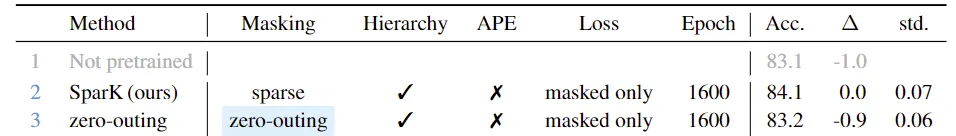
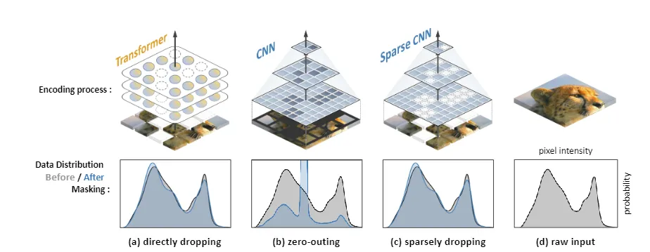
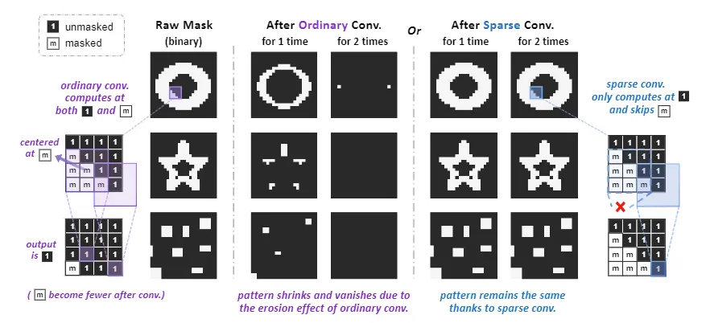
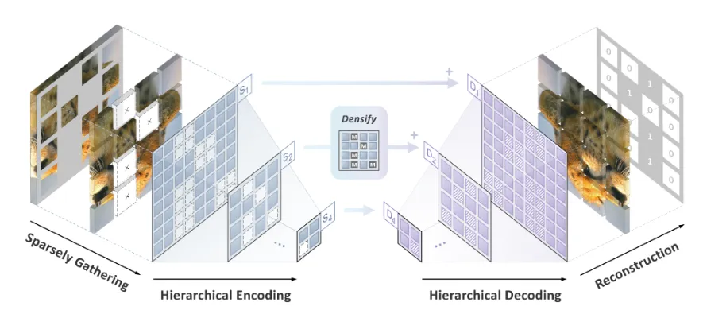
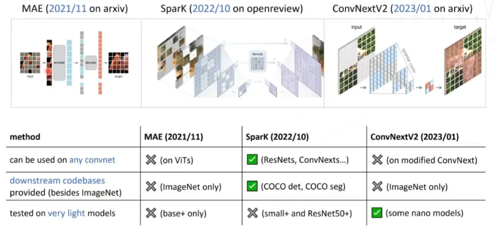

> SparK：[Designing Bert for Convolutional Networkss: Sparse and Hierarchical Masked Modeling](https://github.com/keyu-tian/SparK) (ICLR 2023 Spotlight)
>
> 论文介绍：[https://www.bilibili.com/video/BV11s4y1M7qL/](https://www.bilibili.com/video/BV11s4y1M7qL/)
>

Bert算法是遮住数据的一部分，用模型去进行预测，达到一个自监督学习的效果。迁移到图像领域中的视觉Transformer的工作比如MAE，但是直接将Transformer替换为卷积网络则出现问题。如下图，zero-outing表示直接替换：

<!-- 这是一张图片，ocr 内容为：HIERARCHY APE MASKING EPOCH METHOD STD. LOSS ACC. 83.1 -1.0 NOT PRETRAINED 0.07 SPARK(OURS) 84.1 2 0.0 MASKED ONLY 1600 SPARSE X 3 83.2 0.06 ZERO-OUTING 1600 -0.9 MASKED ONLY ZERO-OUTING -->

可以看到只有0.1个点的提升，是完全无效的。下面是作者的分析。

## 为什么失败？
### 问题1：Pixel Intensity Distribution Shift
Transformer在处理patches时，只要保证是随机删去一些patches，可以保证删除的patches和图像的像素分布是一致的。而卷积神经网络则不能删去一些像素，只能是将一些像素“涂黑”来模拟丢失这部分像素的信息。

<!-- 这是一张图片，ocr 内容为：CNN SPARSE CNN TRANSFORMER ENCODING PROCESS: PIXEL INTENSITY DATA DISTRIBUTION MA PROBABILITY BEFORE/AFTER MASKING: (A)DIRECTLY DROPPING (C)SPARSELY DROPPING (B)ZERO-OUTING (D) RAW INPUT -->

### 问题2：Mask Patttern Vanishing
当我们在zero-outed的图像上做卷积，即进行遮盖后的图像，会发现被mask的地方逐渐消失了，类似图形学操作里的erosion效果。

<!-- 这是一张图片，ocr 内容为：AFTER ORDINARY CONV. RAW MASK AFTER SPARSE CONV. UNMASKED OR FOR 1 TIME FOR 1 TIME (BINARY) FOR 2 TIMES FOR 2 TIMES MASKED SPARSE CONV. ORDINARY CONV. ONLY COMPUTES AT COMPUTES AT BOTH AND SKIPS AND CENTERED AT M M M M M M/M M M M OUTPUT IS 1 1 1 M M M PATTERN SHRINKS AND VANISHES DUE TO BECOME FEWER AFTER CONV.) PATTERN REMAINS THE SAME THE EROSION EFFECT OF ORDINARY CONV. THANKS TO SPARSE CONV. -->

### 问题3：a gap between CV and NLP in data processing
差异如下：

+ NLP中，数据是由一个个单词组成，每个单词都是一个语义单元，有它自己的含义，具有**离散**的特点；而在CV中，数据来自通过照相机获取到的来自真实世界的光学信息，单个像素并不存在某种信息，连续的像素组成的像素集合才可以被看做语义单元，因此收集到的光学信号是拥有**连续**的特点
+ 图像中的物体有大有小，因此我们需要多尺度的图像操作。许多经典的CV模型都是从多个尺度，使用多尺度层次化的结构来处理图像信息
+ 因此NLP中，像Bert模型在处理数据时都是单尺度概念，但CV都是多尺度的概念，这里就有一个 gap，不能忽视这个 gap

## 解决方案
### 使用sparse Convolution
> 解决问题1和2
>

这俩问题的根源都是CNNs不能处理不规则、随机masked的图像，但是ViT可以。

稀疏卷积（想法来自3D卷云的特点）可以跳过所有“empty/masked/zero”的位置，因此：

1. masked的位置在稀疏卷积后不会变少，解决问题2
2. 不需要“zero-out pixels”来模拟丢失操作，即遮盖操作，解决问题1

### 使用hierarchical encoder-decoder
作者使用多尺度的编码解码结构来做BERT式训练，如下图：

<!-- 这是一张图片，ocr 内容为：DENSIFY GHINHA VINNNINA VINGIN VUNNUIA SPARSELY GATHERING RECONSTRUCTION HIERARCHICAL DECODING HIERARCHICAL ENCODING -->

总结如下：

1. 作者的算法作用在4个不同的尺度（4x/8x/16x/32x下采样）
2. 每个稀疏特征$ S_i $喂给decoder来获得$ D_i $，这里稀疏特征会做desify操作，即空的位置填充masked token
3. 和UNet一样的跳连接
4. mask百分之**六十**

和MAE以及同期的ConvNextV2的对比：

<!-- 这是一张图片，ocr 内容为：MAE(2021/11 ON ARXIV) SPARK(2022/10 ON OPENREVIEW) CONVNEXTV2(2023/01 ON ARXIV) INPUT TARGET SPARSE CONV CONVNEXTV2(2023/01) SPARK(2022/10) MAE(2021/11) METHOD X (RESNETS,CONVNEXTS...) (ON VITS) (ON MODIFIED CONVNEXT) CAN BE USED ON ANY CONVNET DOWNSTREAM CODEBASES (COCO DET,COCO SEG) (IMAGENET ONLY) (IMAGENET ONLY) PROVIDED(BESIDES IMAGENET) (SOME NANO MODELS) TESTED ON VERY LIGHT MODELS (BASE+ONLY) (SMALL+AND RESNET50+) -->

几个疑点：

+ mask百分之六十，比例其实是比较高的，原MAE里也是75%，也是非常高的，<u>作者猜测图像里的冗余量比NLP里的冗余量要高很多</u>
+ mask的地方替换为mask token时训练发现loss会变成nan，这个问题很关键，是否说明卷积这种局部信息无法很好的提供重建所需要的语义信息，导致重建的token没有一个明确的还原方向，毕竟局部感受野除非是能够刚好覆盖到目标被mask物体，否则只是一堆像素块。而mask token相当于引入噪声了，Spark这种稀疏卷积的操作则是可以避免被mask部分的影响。

