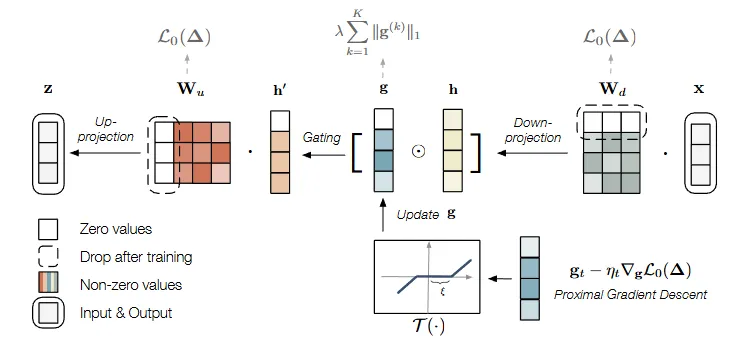
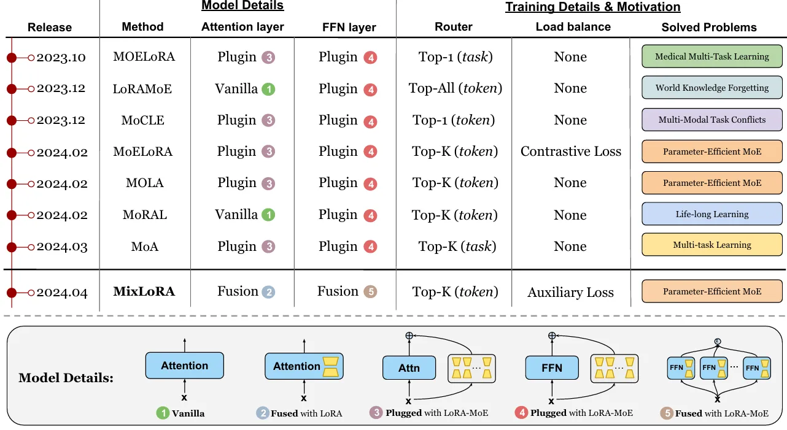
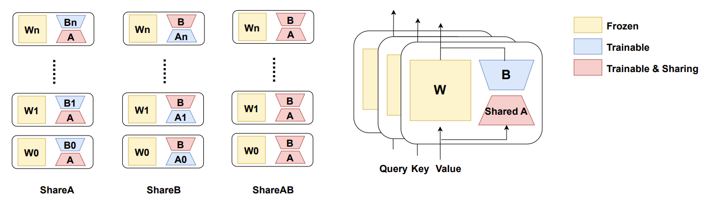

## 1 Timeline Order
> Summarize the literature reviewed in chronological order.
>

+ ### 2023

📝【_**EMNLP 2023 - Main**_】- Sparse Low-rank Adaptation of Pre-trained Language Models (*Tsinghua University, The University of Chicago*)


**Subject:** Adaptive Rank Selection

+ **Problem:** Standard LoRA uses a fixed, inflexible rank (hyperparameter $ r
 $), requiring expensive manual tuning.
+ **Core Idea:** Make the rank learnable rather than fixed.
+ **Mechanism:**
    - **Gating:** Introduces an optimizable gating unit to the low-rank matrices.
    - **Optimization:** Uses proximal gradient methods to update the gates.
    - **Dynamics:** Prunes less important ranks during training automatically.
+ **Result:** Eliminates discrete rank search; the model discovers its own optimal rank structure.


+ ### 2024

🍰【_**Arxiv 2024**_】- MixLoRA: Enhancing Large Language Models Fine-Tuning with LoRA-based Mixture of Experts (*Sichuan University, Purdue University, Emory University, Nanyang Technology University*)


A solid summary of various LoRA variants.


📔【_**ICLR 2024**_】- Mixture of LoRA Experts (*Microsoft Research Asia, Tsinghua University*)

**Subject:** Multiple LoRA Merging
+ **Problem:** Combining multiple LoRA adapters into a single model is challenging. Existing methods (e.g., linear interpolation or reference-tuning) either degrade the generation quality of pre-trained models or incur high training costs.
+ **Core Idea:** Adaptively combine multiple LoRA adapters at each layer by gate function.
+ **Method:** MoLE treats each trained layer of LoRA as an independent expert. It implements hierarchical weight control by embedding a learnable gating function in each layer, and dynamically learns the optimal combination weights by combining gating balance loss and domain-specific loss.
+ **Results:** More flexible merging method for multiple LoRAs with negligible costs.

 

+ ### 2025

🍰【_**Arxiv 2025**_】- ShareLoRA: Parameter Efficient and Robust Large Language Model Fine-tuning via Shared Low-Rank Adaptation (*University of California*)


Numerous efforts are devoted to reducing the trainable parameters of LoRA, but a significant reduction in parameters will lead to slower convergence, and an inadequate reduction method will also make the model prone to over-fitting. **Moreover, many existing PEFT methods struggle to maintain cross-domain robustness after fine-tuning.**
+ **Observation:** LoRA's A and B do not need to be uniquely configured across different layers to achieve optimal performance
+ **Method:** Share matrix A or B across all layers while keeping the corresponding terms (e.g. qkv, out_proj) distinct in each layer.
A variety of sharing strategies (share A, share B or share AB) are explored, with a key finding that such sharing does not compromise model performance.


