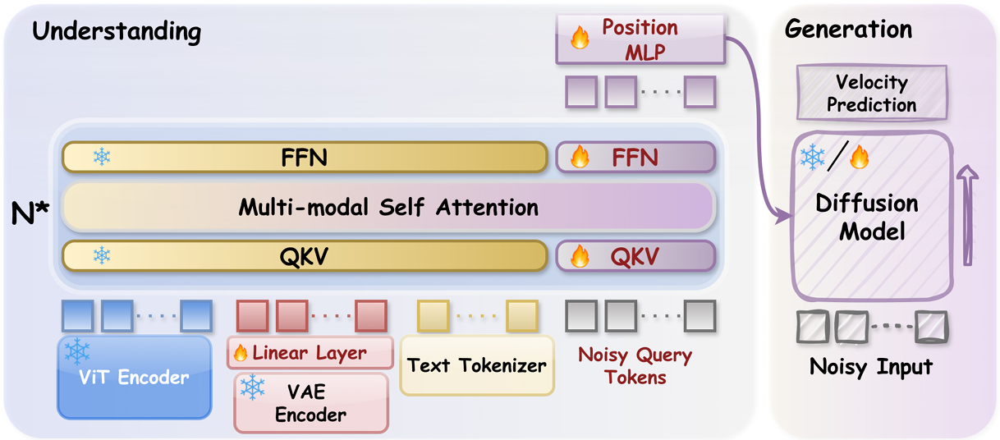
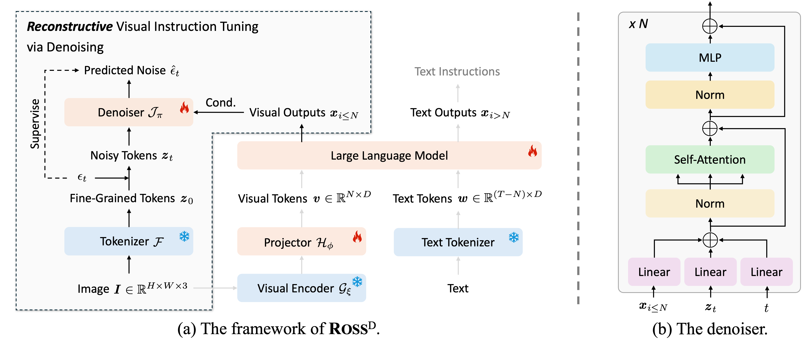

## 1 Timeline Order
> Summarize the literature reviewed in chronological order.

+ ### 2026

{{< paper 
    venue="Arxiv 2026" 
    title="WeMMU: Enhanced Bridging of Vision-Language Models and Diffusion Models via Noisy Query Tokens"
    paper="https://arxiv.org/abs/2512.02536"
    author=""
    org="MoE Key Laboratory of Brain-inspired Intelligent Perception and Cognition, University of Science and Technology of China, Zhejiang University, The Hong Kong University of Science and Technology"
    code=""
    demo=""
    subject="Bridging Pre-trained VLMs and Diffusion Models for UMMs"
    problem="Existing methods (MetaQuery) performs <mark>alignment via learnable queries</mark>, but suffer from poor task generalization. They require retraining in the early stage for significantly different task types."
    idea="Probabilistic Expert Bridge (from Bagel) samples Noisy Query Tokens."
    result="Though the performace is not SOTA, it alleviates task generalization collapse of UMMs, facilitates stable cross-task continual learning and retains fine-grained image details."
>}}
- **Noisy Query Tokens:** Sample tokens from the standard normal distribution $N(0, I)$ at each training step to learn a robust distributed intermediate representation space instead of task-specific features.
- **Probabilistic Expert Bridge:** Freeze VLM core parameters, add a parallel generative pathway, follow the division of labor (VLM for understanding, Diffusion Model for generation), and use Position MLP for feature alignment and spatial cue injection.
- **VAE Branch:** Inject VAE fine-grained features into VLM via a linear projection layer to fuse high-level semantics ans low-level visual details, reducing the Diffusion Models's burden.
- **Progressive Training:** Adopt a four-stage curriculum training strategy, flexibly switch between contrastive/conditional flow matching loss, and gradually upgrade resolution and task complexity.


+ ### 2025

{{< paper 
    venue="ICLR 2025" 
    title="Reconstructive Visual Instruction Tuning"
    paper="https://arxiv.org/abs/..."
    author="https://haochen-wang409.github.io/"
    org="Institute of Automation, Chinese Academy of Sciences, University of Hongkong, MEGVII Tech., StepFun"
    code="https://github.com/haochen-wang409/ross"
    demo="https://haochen-wang409.github.io/ross"
    subject="Visual Instruction Tuning for Large Multimodal Models"
    idea="Reconsturct latent visual tokens of input images by denoiser to supervise the visual outputs of LMMs"
    result="Reconstructive objectives significantly boost LMMs' fine-grained visual comprehension and reduce hallucinations, while generative objectives focus only on high-aesthetic image generation instead of text-image alignment and thus fail to improve multimodal comprehension."
>}}
- **LLM-centric Training Paradigm:** Conventional <u>visual instruction tuning</u> for LMMs rely on vision-to-text alignment and text-only supervision.
- **Extrinstic Assistance:** Previous <u>vision-centric</u> methods leverage extra vision experts[1] at the encoder end to enrich the crucial visual details in images for MLLMs, but require careful manual selection of experts and resulting in a complex inference process.
- **Spatial Redundancy in Images**: Visual signals have heavy spatial redundancy, making it hard to generate meaningful feedback from natural images.
===
- **Reconsturction Variant Design**: Proposes three regression-based reconstruction variants: $\textbf{ROSS}^R\text{-Pixel}$ (regresses raw RGB pixel values via patchify operation), $\textbf{ROSS}^R\text{-Latent}$ (regresses fine-grained latent tokens extracted by frozen teacher tokenizers VAE/DINOv2/DEiT-III), and $\textbf{ROSS}^R\text{-Latent2Pixel}$ (back to RGB pixel space for regression).
- **Training Objective**: 
    - How to reconstruct: Replaces vanilla regression with a per-token denoising objective to address visual spatial redundancy.
    - How to train: Trains the model with a joint loss of original textual next-token prediction and visual reconstructive denoising.
===
[1] <b>S. Tong</b> et al., Eyes wid shut? exploring the visual shortcomings of multimodal llms. in CVPR 2024.


<!-- 
- **环形注意力 (Ring Attention)**：解决超长序列下传感器数据的存储与对齐。
===
- **对比学习**：强化模型在单一模态下的语义提取能力。
- **中医灵感**：引入“经络映射”逻辑优化数字人各部位的协同效率。
===
- [1] He et al., 'Deep Residual Learning', CVPR 2016.
- [2] Vaswani et al., 'Attention is All You Need', NeurIPS 2017.

 -->