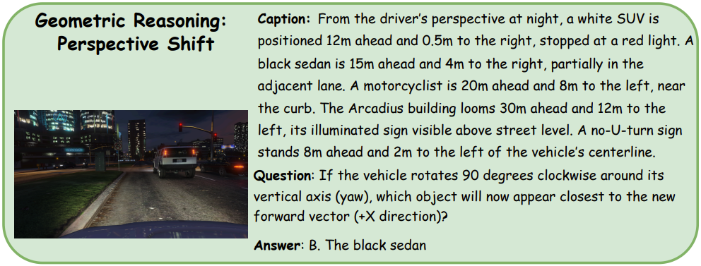

## 1 Benchmark

### 1.1 Textual Benchmarks

{{< paper 
    venue="Arxiv 2026" 
    title="Can LLMs See Without Pixels? Benchmarking Spatial Intelligence from Textual Descriptions"
    paper="https://arxiv.org/abs/2601.03590"
    author="https://binisalegend.github.io/"
    org="Beijing Institute of Technology, BUCT"
    code="https://github.com/binisalegend/SiT-Bench"
    demo=""
    subject="Textual spatial reasoning benchmark for intrinsic LLM spatial intelligence evaluation"
    idea="Convert visual scenes into <mark>coordinate-aware text</mark> to isolate and test <mark>symbolic spatial reasoning</mark> in LLMs."
    result="Best model 59.46% vs. 74.42% human; large gap in global tasks (<10% mapping). CoT significantly improves performance, validating latent but underutilized spatial reasoning."
>}}
- Perception–reasoning entanglement in VLM benchmarks
- Lack of high-fidelity text-only spatial tasks
- Over-reliance on language priors/pattern matching
- Weak evaluation of global consistency, mental mapping
===
- **SiT-Bench:** 3.8K QA across 5 categories, 17 subtasks for spatial cognition
- **Textual Encoding:** Multi-view scenes → coordinate-aware descriptions enabling symbolic reasoning
- **Dual Construction:** Image-based generation + vision-benchmark-to-text adaptation
- **R1 Filtering:** Reasoning-based filtering removes trivial, inconsistent, leakage samples
- **Evaluation Protocol:** Compare LLMs/VLMs with/without CoT to isolate reasoning ability

