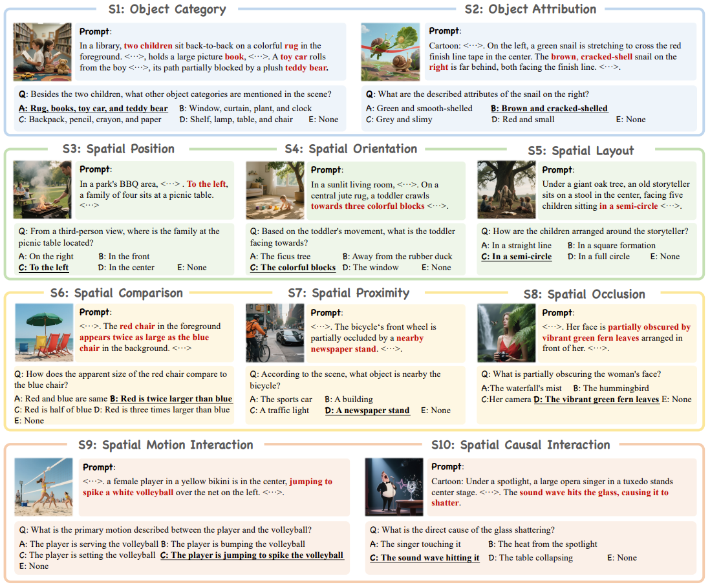
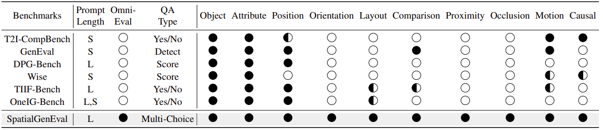

## 1 Benchmark

### 1.1 Textual Benchmarks

{{< paper 
    venue="Arxiv 2026" 
    title="Can LLMs See Without Pixels? Benchmarking Spatial Intelligence from Textual Descriptions"
    paper="https://arxiv.org/abs/2601.03590"
    author="https://binisalegend.github.io/"
    org="Beijing Institute of Technology, BUCT"
    code="https://github.com/binisalegend/SiT-Bench"
    demo=""
    subject="Textual spatial reasoning benchmark for intrinsic LLM spatial intelligence evaluation"
    idea="Convert visual scenes into <mark>coordinate-aware text</mark> to isolate and test <mark>symbolic spatial reasoning</mark> in LLMs."
    result="Best model 59.46% vs. 74.42% human; large gap in global tasks (<10% mapping). CoT significantly improves performance, validating latent but underutilized spatial reasoning."
>}}
- Perception–reasoning entanglement in VLM benchmarks
- Lack of high-fidelity text-only spatial tasks
- Over-reliance on language priors/pattern matching
- Weak evaluation of global consistency, mental mapping
===
- **SiT-Bench:** 3.8K QA across 5 categories, 17 subtasks for spatial cognition
- **Textual Encoding:** Multi-view scenes → coordinate-aware descriptions enabling symbolic reasoning
- **Dual Construction:** Image-based generation + vision-benchmark-to-text adaptation
- **R1 Filtering:** Reasoning-based filtering removes trivial, inconsistent, leakage samples
- **Evaluation Protocol:** Compare LLMs/VLMs with/without CoT to isolate reasoning ability


### 1.2 Text-to-Image Benchmarks

{{< paper 
    venue="ICLR 2026" 
    title="Everything in Its Place: Benchmarking Spatial Intelligence of Text-to-Image Models"
    paper="https://arxiv.org/abs/2601.20354"
    author="https://scholar.google.com/citations?user=0wbrJ20AAAAJ&hl=en&oi=ao"
    org="AMAP - Alibaba Group, Beijing University of Posts and Telecommunications"
    code="https://github.com/AMAP-ML/SpatialGenEval"
    demo=""
    subject="Information-dense Spatial Benchmarking for <mark>Text-to-Image Spatial Intelligence</mark>"
    idea="Use information-dense prompts + omni-dimensional QA to explicitly decompose and measure spatial intelligence across perception, reasoning, and interaction."
    result="Spatial reasoning emerges as dominant bottleneck (~20–30% on key sub-tasks); SpatialT2I yields consistent gains (+4.2%–5.7%), validating data-centric improvement."
>}}
- **Prompt Sparsity:** short / sparse prompts → fail probe complex spatial constraints
- **Metric Coarseness:** yes/no, detection → lack fine-grained diagnosis
- **Spatial Intelligence Gap:** strong "what", weak "where/how/why"
- **Reasoning Blind Spot:** comparison, occlusion, causality under-evaluated
===
- **SpatialGenEval:** 1,230 long prompts + 10 sub-domains; comprehensive spatial coverage
- **Omni-QA Evaluation:** 10 multi-choice QAs per prompt; fine-grained capability diagnosis
- **Hierarchical Decomposition:** foundation → perception → reasoning → interaction modeling
- **Leakage-Free Evaluation:** image-only QA, “None” option prevents forced guessing
- **SpatialT2I Dataset:** 15.4K pairs; rewritten dense prompts for training consistency
- **Data-Centric SFT:** fine-tune T2I models to enhance spatial reasoning
===

===
- **Need Bidirectional Evaluation:** Current T2I benchmarks only test forward generation, but spatial intelligence should be bidirectional and reversible. Can a model truly understand spatial relations if it cannot consistently reconstruct them across generation and interpretation (T2I ↔ I2T)?
- **Cross-modal Spatial Consistency:** Do multimodal models maintain a unified spatial representation when reasoning across image and text, or do they rely on modality-specific shortcuts?
- **Structure-aware Spatial Robustness:** Can a model still perform correct spatial reasoning when specific spatial factors (e.g., position, occlusion) are selectively removed rather than randomly missing?
|||


