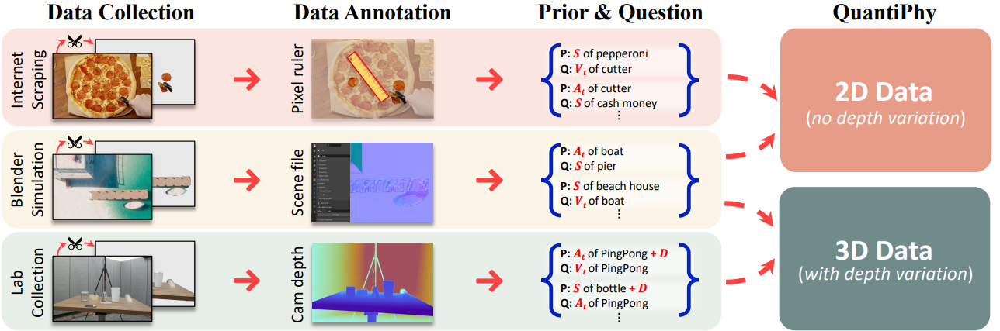
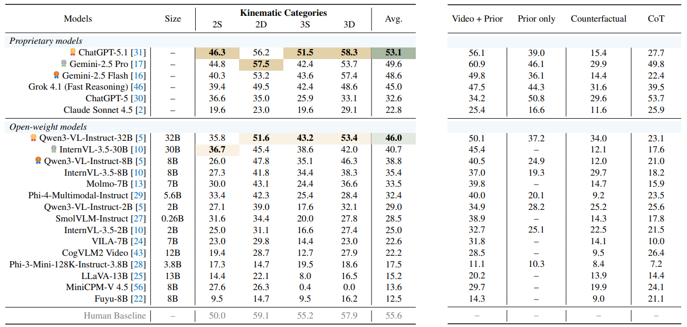
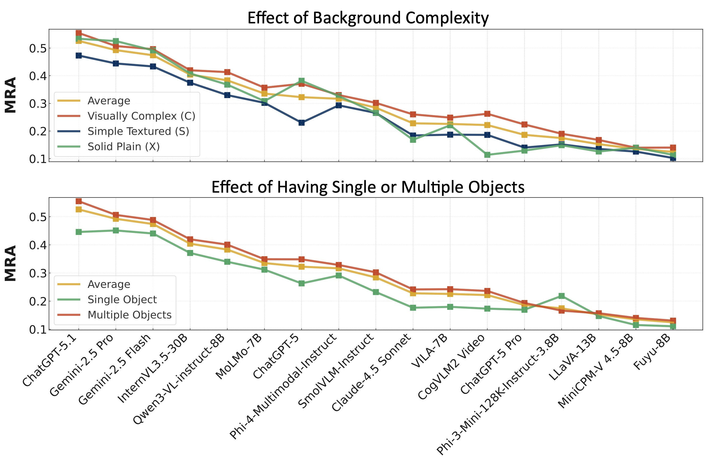

{{< paperbox
    topic="Quantitative Physical Understanding"
    why="Exposes that top VLMs guess physical quantities from memory (pre-trained world knowledge) rather than measure from video, with rigorous tests to diagnose this failure."
    conclusion="Current VLMs are cognitive mimics not physical reasoners, so build systems that arbitrate between perception and memory rather than forcing pure end to end inference. (Context Learning, Agentic AI)"
    org="Stanford University, UST"
    paper="https://arxiv.org/abs/2512.19526"
    code="https://github.com/Paulineli/QuantiPhy"
    project="https://github.com/Paulineli/QuantiPhy"
    author="https://github.com/Paulineli"
>}}


---

## 🚀 1 Motivation & Problem
Humans understand the physical world through structured mathematical abstractions. From Isaac Newton’s formulation of universal gravitation inspired by a falling apple, to modern physics, quantitative laws enable precise reasoning about the dynamics of the real world. In contrast, although state-of-the-art AI systems demonstrate remarkable capabilities in mathematical reasoning, programming, and scientific writing, enabling artificial intelligence to <u><i>ground its understanding in the physical world</i></u> remains a fundamental and unresolved challenge. This limitation poses a critical barrier to deploying AI systems in real-world, embodied environments.

Modern large language models (LLMs) are predominantly trained under the next-token prediction paradigm, which implicitly encourages models to capture statistical regularities in data. A natural extension toward building world models is to train systems to predict future states—such as future frames in videos or evolving spatial configurations. While such approaches can improve perceptual modeling and temporal prediction, they do not necessarily lead to a true understanding of physical laws. Instead, models may learn to imitate surface-level patterns in visual data without acquiring the underlying causal and quantitative structure of the physical world.

This limitation can be intuitively understood by analogy to human cognition. If humans were to perceive the world purely through passive observation, without forming explicit conceptual or physical knowledge, their behavior would be driven by superficial correlations rather than grounded reasoning. As a result, actions would lack an understanding of physical consequences (e.g., failing to infer the danger of falling from a height), reflecting a gap between perception and cognition. Similarly, current AI systems often rely on learned statistical priors rather than principled physical reasoning.

To mitigate this issue, prior work has introduced large-scale datasets in the form of Visual Question Answering (VQA) to inject world knowledge into models. However, such approaches remain insufficient for evaluating true physical understanding.
- **Problem:** Existing benchmarks for physical world understanding are predominantly VQA-based and qualitative. These evaluations often reduce reasoning to discrete answer selection or linguistic plausibility, which can be solved via <u><i>pattern matching</i></u> rather than genuine <u><i>physical inference</i></u>.
- **Insight:** To address this limitation, the authors introduce a new paradigm that evaluates quantitative physical reasoning, focusing on whether models can infer numerical kinematic properties (e.g., size, velocity, acceleration) from visual inputs.

## 💡 2 Methodology
### 2.1 Task Formulation
The paper formulates a kinematic inference task for evaluating physical reasoning in vision-language models. Given a video and a single physical prior (e.g., size $\bold{S}_t^{\text{world}}$, velocity $\bold{V}_t^{\text{world}}$, or acceleration $\bold{A}_t^{\text{world}}$), the model is required to estimate another physical quantity of an target object in real-world units.

<table style="width: 100%; border-collapse: collapse; text-align: left;">
    <caption style="caption-side: top; font-weight: bold; margin-bottom: 8px;">
        Tab. 1: Pixel-to-World Representation and Scale Mapping
    </caption>
    <thead>
        <tr>
            <th>Component</th>
            <th>Definition</th>
            <th>Measurement Units</th>
        </tr>
    </thead>
    <tbody>
        <tr>
            <td>Pixel Space</td>
            <td>Observable quantities derived from video frames</td>
            <td>[pixel], [pixel/s], [pixel/s²]</td>
        </tr>
        <tr>
            <td>World Space</td>
            <td>Physical quantities in real-world coordinates</td>
            <td>[m], [m/s], [m/s²]</td>
        </tr>
        <tr>
            <td>Scale Factor (γ)</td>
            <td>Mapping between pixel space and world space</td>
            <td>[m/pixel]</td>
        </tr>
    </tbody>
</table>

Given a video capturing the translational motion of a target object under a fixed camera, the object's position in pixel space, denoted as $\mathbf{X}_t^{\text{pixel}}$, can be obtained at each time step $t$ from the frames. Based on the resulting discrete trajectory, the velocity and acceleration in pixel space can be estimated using finite difference approximations:
$$
\bold{V}_t^{\text{pixel}}\approx\frac{\bold{X}_{t+\mathrm{d}t}^{\text{pixel}}-\bold{X}_t^{\text{pixel}}}{\mathrm{d}t};
\bold{A}_t^{\text{pixel}}\approx\frac{\bold{X}_{t+2\mathrm{d}t}^{\text{pixel}}-2\bold{X}_{t+\mathrm{d}t}^{\text{pixel}}+\bold{X}_t^{\text{pixel}}}{\mathrm{d}t^2}.
\tag{1}
$$

To convert these pixel-based measurements into real-world physical quantities, a scale factor $\gamma$ is introduced, which maps pixel space to world space. The relationship can be expressed as follows:
$$
\bold{S}_t^{\text{world}}=\gamma \cdot \bold{S}_t^{\text{pixel}};
\bold{V}_t^{\text{world}}=\gamma \cdot \bold{V}_t^{\text{pixel}};
\bold{A}_t^{\text{world}}=\gamma \cdot \bold{A}_t^{\text{pixel}}.
\tag{2}
$$
Thus, we can compute the kinematic properties from the video and these priors.

### 2.2 Benchmark Design
For comprehensively evaluate of the kinematic movements above, <span style="font-family: Times New Roman; font-variant: small-caps;">QuantiPhy</span> include video-question pairs along three primary axes. The first two axes define the core reasoning task:
- <b>Dimensionality: {2D, 3D}.</b> 2D movement assumes motion strictly in the x-y plane (constant depth), while 3D movement includes the z-axis (varying depth), making it intrinsically more challenging.
- <b>Physical prior: {Static, Dynamic}.</b> The Static prior provides constant object size $\bold{S}^{\text{world}}$ throughout the video, while the Dynamic prior provides velocity $\bold{V}_t^{\text{world}}$ or acceleration $\bold{A}_t^{\text{world}}$ at a given timestep $t$.

These two axes yield four tasks: 2D-Static (2S), 2D-Dynamic (2D), 3D-Static (3S), and 3D-Dynamic (3D). The data statistic of <span style="font-family: Times New Roman; font-variant: small-caps;">QuantiPhy</span> benchmark is presented in [Table 2](#table2).

<table style="width: 100%; border-collapse: collapse; text-align: left;" id=table2>
    <caption style="caption-side: top; font-weight: bold; margin-bottom: 8px;">
        Tab. 2: Data Statistics of the QuantiPhy Benchmark
    </caption>
    <thead>
        <tr>
            <th>Category</th>
            <th>Value</th>
            <th>Description</th>
        </tr>
    </thead>
    <tbody>
        <tr>
            <td>Total Videos</td>
            <td>569</td>
            <td>Unique video samples collected from multiple sources</td>
        </tr>
        <tr>
            <td>Total QA Pairs</td>
            <td>3,355</td>
            <td>Video-question pairs with numerical ground truth</td>
        </tr>
        <tr>
            <td>Task Types</td>
            <td>4</td>
            <td>2D-Static, 2D-Dynamic, 3D-Static, 3D-Dynamic</td>
        </tr>
        <tr>
            <td>Video Duration</td>
            <td>2–3 seconds</td>
            <td>Typical length of each video clip</td>
        </tr>
        <tr>
            <td>Data Sources</td>
            <td>3</td>
            <td>Blender simulation, lab capture, internet videos</td>
        </tr>
        <tr>
            <td>Storage Size</td>
            <td>~115 MB</td>
            <td>Total dataset size after processing</td>
        </tr>
    </tbody>
</table>

### 2.3 Data Construction
QuantiPhy employs a three-stage construction pipeline that balances experimental control with real-world diversity. As illustrated in [Figure 2.1](#fig-construction), the authors integrate synthetic simulation, controlled laboratory capture, and in-the-wild internet videos to create a comprehensive evaluation benchmark.

<figure id="fig-construction">
    
    <figcaption><span class="auto-fig-title">The construction of QuantiPhy Benchmark</span></figcaption>
</figure>

<b>Stage 1: Data Collection.</b> The authors source videos from three complementary channels to ensure broad coverage of physical scenarios:
<table style="width: 100%; border-collapse: collapse; text-align: left;">
    <caption style="caption-side: top; font-weight: bold; margin-bottom: 8px;">
        Tab. 3: Data Source Characteristics and Collection Methodology
    </caption>
    <thead>
        <tr>
            <th>Source</th>
            <th>Quantity</th>
            <th>Key Characteristics</th>
            <th>Primary Use Case</th>
        </tr>
    </thead>
    <tbody>
        <tr>
            <td>Blender Simulation</td>
            <td>300 videos</td>
            <td>Full physical control; precise ground-truth; scalable scene variation</td>
            <td>Controlled experiments; counterfactual testing</td>
        </tr>
        <tr>
            <td>Lab Capture</td>
            <td>112 videos</td>
            <td>Real-world physics; 4D metric reconstruction; calibrated multi-view</td>
            <td>Real sensor validation; depth-varying 3D motion</td>
        </tr>
        <tr>
            <td>Internet Scraping</td>
            <td>72 videos</td>
            <td>Natural scenes; diverse distributions; uncontrolled conditions</td>
            <td>Out-of-distribution evaluation</td>
        </tr>
        <tr>
            <td>Segmented (SAM2)</td>
            <td>85 videos</td>
            <td>Isolated objects on plain backgrounds; background ablation</td>
            <td>Scene complexity analysis</td>
        </tr>
    </tbody>
</table>

- <b>Blender Simulation</b> enables precise control over object kinematics, camera parameters, and scene composition. They render scenes using Cycles/EEVEE engines with varying resolutions (1920×1080, 1080×1080, 480×960), frame rates (24–120 fps), and lighting conditions. Motion types include: (i) keyframed animation for articulated objects (humans, animals), and (ii) physics-driven simulation for rigid-body dynamics with Newtonian constraints.

- <b>Lab Capture</b> utilizes four Orbbec Femto Mega RGB-D cameras arranged in multi-view stereo configuration. They capture diverse motions including free fall, sliding, pendulum oscillation, and bouncing across small-scale (desk-top) and large-scale (room-scale) setups.

- <b>Internet Videos</b> are manually curated from open-source platforms and author-recorded footage, strictly filtered for static camera, translational motion, and visible reference objects. All identifiable information (faces, license plates) is anonymized via blurring.

<b>Stage 2: Data Annotation.</b> They employ source-specific annotation protocols to extract precise kinematic ground truth:
<table style="width: 100%; border-collapse: collapse; text-align: left;">
    <caption style="caption-side: top; font-weight: bold; margin-bottom: 8px;">
        Tab. 4: Annotation Methods by Data Source
    </caption>
    <thead>
        <tr>
            <th>Source</th>
            <th>Annotation Method</th>
            <th>Extracted Quantities</th>
            <th>Precision</th>
        </tr>
    </thead>
    <tbody>
        <tr>
            <td>Blender</td>
            <td>Automated Python scripts querying scene graph</td>
            <td>Size, displacement, velocity, acceleration, depth</td>
            <td>Exact (floating-point)</td>
        </tr>
        <tr>
            <td>Lab</td>
            <td>UI-assisted depth clicking + multi-view triangulation</td>
            <td>Metric depth, 3D trajectory, instantaneous velocity/acceleration</td>
            <td>±1 cm (depth camera limited)</td>
        </tr>
        <tr>
            <td>Internet</td>
            <td>Interactive pixel measurement tool + reference scaling</td>
            <td>Pixel kinematics → world units via γ estimation</td>
            <td>Approximate (reference-dependent)</td>
        </tr>
    </tbody>
</table>

<b>Stage 3: Task Formulation.</b> Each video is associated with multiple (prior, question, ground-truth) triplets following the kinematic inference framework:
<table style="width: 100%; border-collapse: collapse; text-align: left;">
    <caption style="caption-side: top; font-weight: bold; margin-bottom: 8px;">
        Tab. 5: Video-Text Record Schema
    </caption>
    <thead>
        <tr>
            <th>Field</th>
            <th>Description</th>
            <th>Example</th>
        </tr>
    </thead>
    <tbody>
        <tr>
            <td>video_id</td>
            <td>Unique identifier</td>
            <td>simulation_0032</td>
        </tr>
        <tr>
            <td>video_type</td>
            <td>4-character code: [Prior][Dim][Objects][Background]</td>
            <td>A3MC (Acceleration, 3D, Multiple objects, Complex)</td>
        </tr>
        <tr>
            <td>inference_type</td>
            <td>Prior dynamics → Target dynamics (S=static, D=dynamic)</td>
            <td>DD (Dynamic prior → Dynamic target)</td>
        </tr>
        <tr>
            <td>ground_truth_prior</td>
            <td>Provided physical constant with unit</td>
            <td>gravity acc = 9.8 m/s²</td>
        </tr>
        <tr>
            <td>depth_info</td>
            <td>Temporal depth annotations (3D tasks only)</td>
            <td>t=1s, distance_ball_camera = 1.4020m</td>
        </tr>
        <tr>
            <td>ground_truth_posterior</td>
            <td>Numerical answer (unit specified in question)</td>
            <td>2.86</td>
        </tr>
    </tbody>
</table>

The four-character video type code systematically encodes task complexity:
- <b>1st character:</b> S (Size prior), V (Velocity prior), or A (Acceleration prior)
- <b>2nd character:</b> 2 (2D planar motion) or 3 (3D depth-varying motion)
- <b>3rd character:</b> S (Single object) or M (Multiple objects requiring relational reasoning)
- <b>4th character:</b> X (Plain background), S (Simple texture), or C (Complex scene)
This schema yields 36 fine-grained categories (e.g., A2SX, V3MC), each populated with ≥4 videos to ensure statistical validity. The final dataset comprises <u><i>569 unique videos</i></u> and <u><i>3,355 question-answer pairs</i></u>, with 2D:3D ratio of approximately 4:3 and balanced distribution across inference types.

## 🛠️ 3 Evaluation Protocol
The QuantiPhy evaluation framework is designed to rigorously assess Vision-Language Models' quantitative physical reasoning through standardized prompting, robust parsing, and calibrated metrics. Their protocol addresses three critical challenges: (i) ensuring consistent model behavior across diverse architectures, (ii) extracting reliable numerical predictions from potentially verbose outputs, and (iii) measuring proximity to ground truth with appropriate tolerance for physical measurement uncertainty.

### 3.1 Benchmark Models
The authors evaluate 21 state-of-the-art VLMs spanning proprietary APIs and open-weight architectures to ensure comprehensive coverage of current capabilities:
<table style="width: 100%; border-collapse: collapse; text-align: left;">
    <caption style="caption-side: top; font-weight: bold; margin-bottom: 8px;">
        Tab. 6: Evaluated Model Suite
    </caption>
    <thead>
        <tr>
            <th>Category</th>
            <th>Models</th>
            <th>Key Characteristics</th>
        </tr>
    </thead>
    <tbody>
        <tr>
            <td rowspan="4">Proprietary</td>
            <td>ChatGPT-5.1, ChatGPT-5</td>
            <td>OpenAI multimodal with extended CoT reasoning</td>
        </tr>
        <tr>
            <td>Gemini-2.5 Pro/Flash</td>
            <td>Google long-context video understanding</td>
        </tr>
        <tr>
            <td>Grok-4.1 (Fast Reasoning)</td>
            <td>xAI rapid inference with reasoning optimization</td>
        </tr>
        <tr>
            <td>Claude-4.5 Sonnet</td>
            <td>Anthropic detailed explanatory generation</td>
        </tr>
        <tr>
            <td rowspan="4">Open-Weight<br>(Scaling Series)</td>
            <td>Qwen3-VL-Instruct (2B/8B/32B)</td>
            <td>Alibaba architecture scaling analysis</td>
        </tr>
        <tr>
            <td>InternVL-3.5 (2B/8B/30B)</td>
            <td>Shanghai AI Lab vision-language alignment</td>
        </tr>
        <tr>
            <td>Phi-4-Multimodal / Phi-3-Mini</td>
            <td>Microsoft efficient multimodal design</td>
        </tr>
        <tr>
            <td>SmolVLM-Instruct (256M)</td>
            <td>Ultra-lightweight edge deployment</td>
        </tr>
        <tr>
            <td rowspan="2">Specialized</td>
            <td>Molmo-7B, VILA-7B, LLaVA-13B</td>
            <td>Academic research architectures</td>
        </tr>
        <tr>
            <td>MiniCPM-V 4.5, CogVLM2-Video</td>
            <td>Native video input processing</td>
        </tr>
    </tbody>
</table>

**Deployment Configuration:** Proprietary models are accessed via official APIs (OpenAI, Google, Anthropic, xAI). Open-weight models are hosted via Replicate API or self-deployed with vLLM. Temperature is fixed at 0–0.1 for deterministic outputs; token limits range from 500 (lightweight models) to 10,000 (reasoning-intensive models).

### 3.2 Prompting Strategy
They employ a constrained generation protocol designed to minimize output variance and enforce numerical precision:
<table style="width: 100%; border-collapse: collapse; text-align: left;">
    <caption style="caption-side: top; font-weight: bold; margin-bottom: 8px;">
        Tab. 7: Standardized Prompt Structure
    </caption>
    <thead>
        <tr>
            <th>Component</th>
            <th>Content</th>
            <th>Purpose</th>
        </tr>
    </thead>
    <tbody>
        <tr>
            <td>[Video Frames]</td>
            <td>Full temporal sequence at 480p resolution; all frames retained</td>
            <td>Preserve motion dynamics; avoid temporal aliasing</td>
        </tr>
        <tr>
            <td>[System Prompt]</td>
            <td>"You are an expert video analyst specializing in physics measurements"</td>
            <td>Establish authoritative persona; pilot-validated for adherence</td>
        </tr>
        <tr>
            <td>[Ground Truth Prior]</td>
            <td>Single physical constant (e.g., "length of yellow car = 5.67m")</td>
            <td>Enable scale factor γ determination</td>
        </tr>
        <tr>
            <td>[Depth Info] (3D only)</td>
            <td>Temporal camera-object distances</td>
            <td>Support depth-varying kinematic inference</td>
        </tr>
        <tr>
            <td>[Question]</td>
            <td>Target quantity with explicit unit and timestamp</td>
            <td>Remove ambiguity in prediction target</td>
        </tr>
        <tr>
            <td>[Post-Prompt]</td>
            <td>"Output ONLY the numerical answer and unit. No explanation."</td>
            <td>Suppress verbose CoT; enforce parseability</td>
        </tr>
    </tbody>
</table>

**Critical Design Choices:**
- **Temporal fidelity over spatial resolution:** 480p preserves all frames; subsampling degrades velocity/acceleration tracking
- **Single prior constraint:** Exactly one physical constant provided to test scale transformation, not multi-factor estimation
- **Deterministic decoding:** Greedy sampling (temperature=0) where supported; default parameters otherwise.

### 3.3 Answer Retrieval and Parsing
Given model outputs ranging from concise numerical responses to extensive analytical narratives, they implement a hierarchical parsing pipeline:

```text
1. Exact Match: Check if response matches [number][unit] format
2. Delimiter Search: Scan for "=", "Final Answer:", "=>", ":" → Retain substring after last delimiter
3. Unit Sanitization: Remove "meters", "m/s", "cm/s²" etc.
4. Heuristic Extraction: Apply regex for floating-point numbers → Take absolute value; select last valid number if multiple
5. Failure Handling: Return None if no valid number identified
```


### 3.4 Evaluation Metric: Mean Relative Accuracy (MRA)
The authors adopt MRA as the primary metric, extending the design from VSI-Bench with threshold calibration for physical reasoning tasks:
$$
\text{MRA}=\frac{1}{10}\sum_{\theta\in\mathcal{C}}\mathbb{1}\bigg(\frac{|\hat{y}-y|}{|y|}\lt 1-\theta\bigg),\quad \mathcal{C}=\{0.5,0.55,...,0.95\}
\tag{3}
$$
<table style="width: 100%; border-collapse: collapse; text-align: left;">
    <caption style="caption-side: top; font-weight: bold; margin-bottom: 8px;">
        Tab. 8: MRA Design Rationale and Properties
    </caption>
    <thead>
        <tr>
            <th>Property</th>
            <th>Description</th>
            <th>Physical Reasoning Justification</th>
        </tr>
    </thead>
    <tbody>
        <tr>
            <td>Multi-threshold</td>
            <td>10 confidence levels (0.5–0.95)</td>
            <td>Captures gradations of "accurate enough"; avoids binary rigidity</td>
        </tr>
        <tr>
            <td>Relative error</td>
            <td>$|\hat{y}-y|/|y|$ rather than absolute</td>
            <td>Scale-invariant; comparable across microscopic to astronomical scenes</td>
        </tr>
        <tr>
            <td>Partial credit</td>
            <td>Linear accumulation across thresholds</td>
            <td>3.1m error (3% relative) rewarded; 31m error (1000% relative) penalized</td>
        </tr>
        <tr>
            <td>Robustness</td>
            <td>Indicator function rather than continuous loss</td>
            <td>Tolerates annotation ambiguity (hair inclusion in height, rim vs. outer diameter)</td>
        </tr>
    </tbody>
</table>

**Aggregation Protocol:**
- **Question-level:** MRA computed per (video, question) pair.
- **Category-level:** Average MRA across all questions in {2D-Static, 2D-Dynamic, 3D-Static, 3D-Dynamic}.
- **Model-level:** Unweighted mean of four category scores.

Questions with no valid numerical output after 5 retries contribute MRA = 0 to the category average.

## 📊 4 Experiments
### 4.1 Main Results
[Figure 4.1](#fig-results)  presents performance across four kinematic inference categories. ChatGPT-5.1 achieves the highest overall MRA (53.1%), marginally surpassing humans on 2D-Dynamic tasks but remaining below the human average of 55.6%. Open-weight models exhibit clear scaling effects: Qwen3-VL improves from 29.0% (2B) to 46.0% (32B), with gains most pronounced on dynamic categories requiring temporal integration.

<figure id="fig-results">
    
    <figcaption><span class="auto-fig-title">Main Results on QuantiPhy (MRA %)</span></figcaption>
</figure>

### 4.2 Effect of Scene Context
The authors analyze performance across scene difficulty axes:
- **Background Complexity:** Performance in complex backgrounds (C, 0.40 MRA) slightly exceeds simple textures (S, 0.38) and plain backgrounds (X, 0.35). Realistic backgrounds provide additional scale reference cues (road markings, architectural elements) that aid inference.
- **Object Multiplicity:** Multiple-object scenes (M) consistently outperform single-object scenes (S) by 3–5 MRA points. Additional objects serve as implicit comparison standards for size and speed estimation.

<figure id="fig-context" style="width: 80%">
    
    <figcaption><span class="auto-fig-title">Effect pf scene context</span></figcaption>
</figure>

## 🧠 5 Reflection & Inspiration
The study reveals that current vision-language models struggle with quantitative physical reasoning.
Instead of relying on visual evidence and provided priors, they tend to depend <u><i>heavily on pre-trained world knowledge</i></u>, leading to limited numerical accuracy and poor input faithfulness.
* **Pros:** 
  1. **Novel quantitative paradigm:** Moves beyond binary VQA evaluation to continuous numerical accuracy with MRA metric, distinguishing 3.1m error (acceptable) from 31m error (catastrophic).
  2. **Controlled yet diverse data:** Blender simulation enables exact ground-truth and systematic variation; lab capture adds real-world validation; internet data tests distribution generalization.
* **Cons:** 
  1. **Simplified physical scope:** Restricted to translational motion of rigid objects—no rotation, deformation, fluid dynamics, or multi-body contact physics relevant to real robotics.
  2. **Fixed camera assumption:** Eliminates ego-motion ambiguity present in embodied navigation and AR/VR applications (not general scenarios).
  3. **No possible solution:** Benchmark identifies failure modes but provides no demonstration of improved training recipes or fine-tuning strategies to address the
* **Inspiration:**
  1. **From perception to cognition:** Personal testing on VSI-Bench confirms SOTA models maintain strong performance (e.g., Object Counting) without visual input—mirroring QuantiPhy's findings. Rather than forcing pure perception, we should architect <u><i>cognitive systems</i></u> that strategically arbitrate between sensing and memory, transforming VLMs from passive perceivers into active agents that know when to look and when to recall.
  2. **Agentic system as solution pathway:** Even with substantial room for base model improvement, the immediate deployment of embodied AI may benefit more from intelligent system design—explicit uncertainty quantification, selective memory retrieval, and input-confidence gating—than from waiting for perfect end-to-end physical reasoning to emerge.