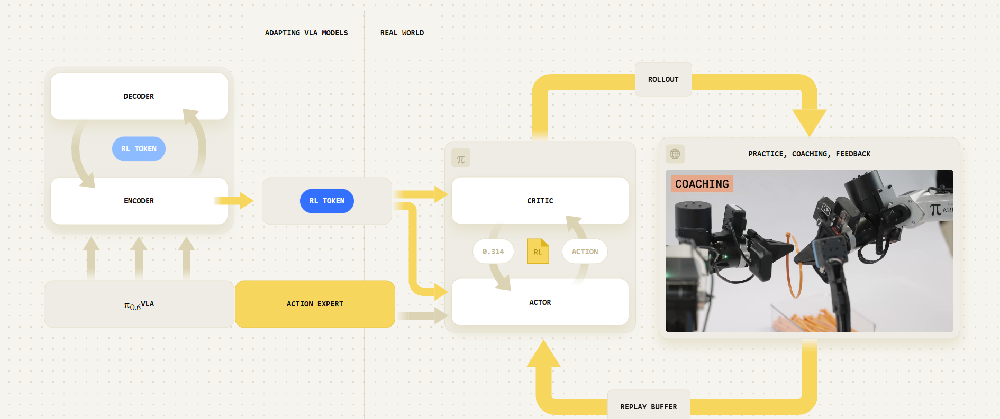
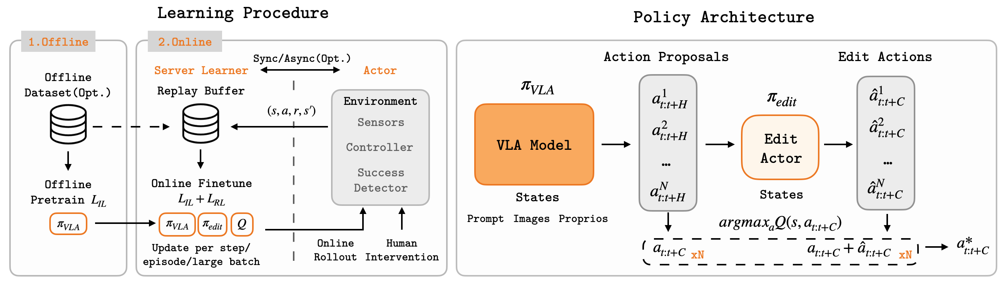
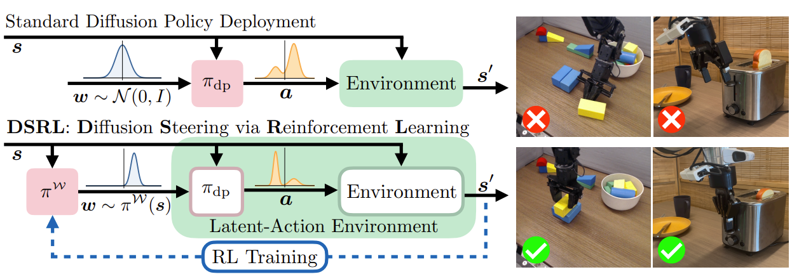

## 1 Timeline Order
> Summarize the literature reviewed in chronological order.

+ ### 2026

{{< paper 
    venue="Arxiv 2026"
    title="RL Token: Bootstrapping Online RL with Vision-Language-Action Models"
    paper="https://arxiv.org/abs/2604.23073"
    author="Charles Xu, Jost Tobias Springenberg, Michael Equi, Ali Amin, Adnan Esmail, Sergey Levine, Liyiming Ke"
    org="Physical Intelligence"
    code=""
    demo="https://www.pi.website/research/rlt"
    subject="Efficient Online RL with Vision-Language-Action Models"
    idea="Expose a compact RL token from a pretrained VLA and use a lightweight actor-critic to refine its actions while anchoring the learned policy to the original VLA behavior."
    result="Enables efficient online RL finetuning of pretrained VLAs, improving manipulation speed and success rates within minutes to a few hours of real-world practice."
>}}
Existing approaches either train large VLAs directly with RL, which is computationally expensive, or <mark>train separate policies that cannot efficiently access the rich knowledge encoded in pretrained VLA representations</mark>. RLT introduces a compact RL token as an efficient interface between the frozen VLA and online RL.
===
- **RL Token:** Adapt the pretrained VLA to expose a compact task-relevant representation $z_{RL}$ that preserves useful pretrained knowledge while providing an efficient state interface for online RL.
- **Lightweight Actor-Critic:** Freeze the Stage-1 VLA representation model and train a small actor-critic on the RL token, proprioceptive state, and VLA reference action chunk.
- **Reference-action Conditioning:** Use the VLA-generated action chunk as an explicit behavioral prior. The RL actor refines the VLA action instead of learning the complete manipulation behavior from scratch.
- **Behavioral Anchoring:** Combine Q-driven optimization with a BC/reference-action objective so that the learned policy remains close to the pretrained VLA behavior when RL does not provide sufficient evidence for deviation.
- **Chunk-level RL:** Operate the actor and critic on temporally extended action chunks, reducing the effective RL decision horizon and making online learning more sample efficient.


{{< paper 
    venue="CoRL 2026"
    title="EXPO-FT: Sample-Efficient Reinforcement Learning Finetuning for Vision-Language-Action Models"
    paper="https://arxiv.org/abs/2605.25477"
    author="https://pd-perry.github.io/"
    org="Stanford University"
    code="https://github.com/pd-perry/expo-ft"
    demo="https://pd-perry.github.io/expo-ft/"
    subject="Sample-efficient RL Finetuning of Vision-Language-Action Models"
    idea="Extend EXPO to pretrained VLA models by combining a lightweight action-editing policy, Q-guided selection, temporally extended action chunks, and human-in-the-loop feedback."
    result="Achieves 30/30 successes across the evaluated real-world manipulation tasks using an average of about 19.1 minutes of online robot data."

>}}

Existing VLA RL methods either train separate lightweight policies without directly finetuning the pretrained VLA, or require substantial online interaction. EXPO-FT builds on EXPO to directly finetune pretrained VLAs while preserving their strong behavioral priors and exploiting their native action-chunk interface.
===
- **Action Edit Policy:** Keep the pretrained VLA as a strong base policy and train a lightweight edit policy to predict an action correction $\hat{a}$, producing the final action $\tilde{a}=a+\hat{a}$. This allows RL to search locally around the VLA's pretrained behavior rather than relearning the policy from scratch.
- **Q-guided Action Selection:** Train a Q-function to evaluate both the original VLA action and edited actions, then select the candidate with the highest estimated value. This provides a direct mechanism for preserving the pretrained action when an RL edit is not beneficial.
- **Temporally Extended Actions:** Extend EXPO from single-step actions to the action chunks naturally produced by modern VLAs. Both the edit policy and Q-function operate over executed action chunks, preserving the temporal abstraction of the VLA.
- **Human-in-the-loop Feedback:** Allow human operators to intervene during online training and provide corrective actions when autonomous exploration is insufficient, improving data efficiency and reliability.
- **Direct VLA Finetuning:** Unlike methods that only train an auxiliary policy on top of a frozen VLA, EXPO-FT incorporates RL into the VLA finetuning pipeline while retaining the original supervised VLA objective.


+ ### 2025

{{< paper 
    venue="CoRL 2025"
    title="Steering Your Diffusion Policy with Latent Space Reinforcement Learning"
    paper="https://proceedings.mlr.press/v305/wagenmaker25a.html"
    author=""
    org="UC Berkeley, University of Washington, Amazon"
    code="https://github.com/ajwagen/dsrl"
    demo=""
    subject="Latent-space Reinforcement Learning for Diffusion Policies"
    idea="Steer a frozen diffusion/flow policy by learning a policy over its latent-noise space instead of directly finetuning the base policy."
    result="Achieves sample-efficient autonomous policy improvement on simulated and real-world robotic tasks while requiring only black-box access to the pretrained policy."

>}}
Existing methods <mark>directly finetune diffusion policies with RL</mark>, which is computationally expensive and can disturb the pretrained behavior prior. DSRL instead keeps the diffusion policy frozen and performs RL in its latent-noise space.
===
- **Latent-space Steering:** Keep the pretrained diffusion/flow policy frozen and learn an RL policy that modifies the initial latent noise used by the denoising process. The resulting noise is passed through the original policy to generate the action chunk.
- ***lack-box Policy Access:** The pretrained policy does not need to expose or update its internal parameters. RL only interacts with the policy through its input/output interface, making the adaptation lightweight.
- **Action-space Critic:** DSRL can evaluate the resulting actions using a Q-function in action space and transfer the learned value information back to the latent-noise policy. The released implementation includes DSRL-SAC and DSRL-NA variants.
- **Policy Prior Preservation:** Since the diffusion/flow policy parameters remain fixed, RL exploration remains constrained by the behavior distribution represented by the pretrained policy.
- **Chunk-level Control:** One latent sample generates a temporally extended action sequence, reducing the effective decision frequency and improving the efficiency of online RL.


